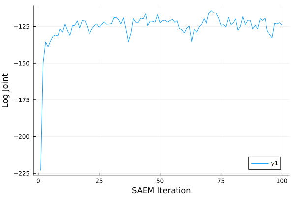

# MCMCSAEM

This code base is using the [Julia Language](https://julialang.org/) and
[DrWatson](https://juliadynamics.github.io/DrWatson.jl/stable/)
to make a reproducible scientific project named
> Stochastic Approximation with Biased MCMC for Expectation Maximization

## Installation

```julia
using Pkg
Pkg.develop(url="https://github.com/Red-Portal/MCMCSAEM.jl.git")
```

## Example
Consider the logistic regression problem
```math
\begin{aligned}
    \beta &\sim \mathcal{N}(\mu \mathbf{I}, \sigma^2 \mathbf{I}) \\
    y_i   &\sim \mathrm{Bern}(\beta^{\top}x).
\end{aligned}
```
We will show how to infer the hyperparameters $\mu$ and $\sigma$ through SAEM.

The likelihood itself can be specificed as follows using the [LogDensityProblems](https://github.com/tpapp/LogDensityProblems.jl) interface:
```julia
using MCMCSAEM
using Distributions
using LogDensityProblems

struct Logistic{Mat <: AbstractMatrix, Vec <: AbstractVector}
    X::Mat
    y::Vec
end

function LogDensityProblems.capabilities(::Type{<:Logistic})
    LogDensityProblems.LogDensityOrder{0}()
end

function LogDensityProblems.logdensity(
    model::Logistic, β::AbstractVector, θ::AbstractVector
)
    X, y = model.X, model.y
    d    = size(X,2)
    s    = X*β   
    μ, σ = θ[1], θ[2]
    ℓp_x = mapreduce(+, s, y) do sᵢ, yᵢ
        logpdf(BernoulliLogit(sᵢ), yᵢ)
    end
    ℓp_β = logpdf(MvNormal(fill(μ, d), σ), β)
    ℓp_x + ℓp_β
end
```

`MCMCSAEM` expects the user to define its own E-step and M-step functions.
For the E-step (obtaining the sufficient statistic), we only need the first and second moments of $\beta$:
```julia
function MCMCSAEM.sufficient_statistic(
	::Logistic, x::AbstractMatrix, θ::AbstractVector
)
 	μ = θ[1]
    mean(eachcol(x)) do xi
        vcat(xi, (xi .- μ).^2)
    end
end
```

The M-step receives the estimated sufficient statistic and returns the hyperparameters maximizing the EM surrogate. (Refer to the paper for more details.)
```julia
function MCMCSAEM.maximize_surrogate(::Logistic, S::AbstractVector)
    d  = div(length(S), 2)
    X  = S[1:d]
    X² = S[d+1:end]
    μ  = mean(X)
    [μ, sqrt(mean(X²))]
end
```

SAEM can be executed as follows:
```julia
using ADTypes
using Random
using Plots

function main()
    rng = Random.default_rng()

    # SAEM Settings
    T         = 100               # Number of SAEM iterations
    T_burn    = 5                # Number of initial burn-in steps
    γ0        = 1e-0              # Base stepsize
    γ         = t -> γ0 / sqrt(t) # Stepsize schedule
    h         = 1e-2              # MCMC stepsize
    mcmc_type = :ula              # MCMC algorithm (:ula or :mala)

    ad     = ADTypes.AutoForwardDiff() # autodiff backend

    # Create synthetic dataset
    n      = 500                                        # n_datapoints
    d      = 30                                         # n_regressors
    X      = randn(rng, n, d)                           # regressors
    θ_true = [-0.5, 2.0]                                # "True" hyperparameters
    β_true = rand(rng, Normal(θ_true[1], θ_true[2]), d) # True coefficients
    y      = rand.(rng, BernoulliLogit.(X*β_true))      # Target variables
    
    # Create Model
    model = Logistic(X, y)

    # Initialize SAEM
    θ0    = [0.0, 5.0]
    x0    = randn(rng, d, 1)

    θ, x, stats = MCMCSAEM.mcmcsaem(
        rng, model, x0, θ0, T, T_burn, γ, h;
        ad, 
        show_progress = true, 
        mcmc_type = mcmc_type
    )
    plot([stat.loglike for stat in filter(Base.Fix2(haskey, :loglike), stats)], xlabel="SAEM Iteration", ylabel="Log Joint")
end

main()
```

We can see the log joint going up as we converge:



## Experiments in the Paper
The experiments in the paper can be replicated by executing the scripts in `scripts/`.
